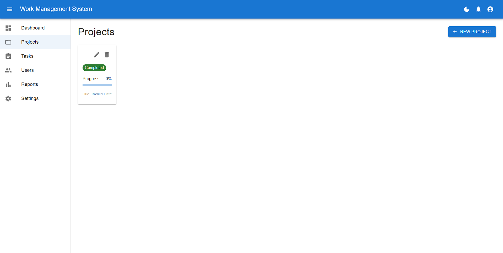
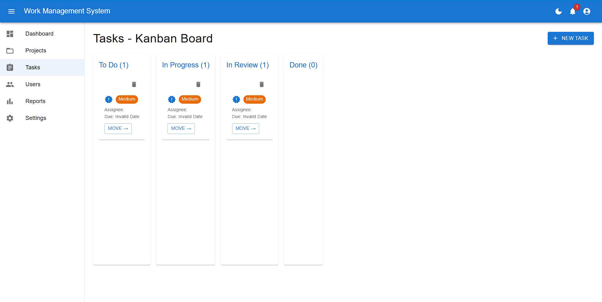
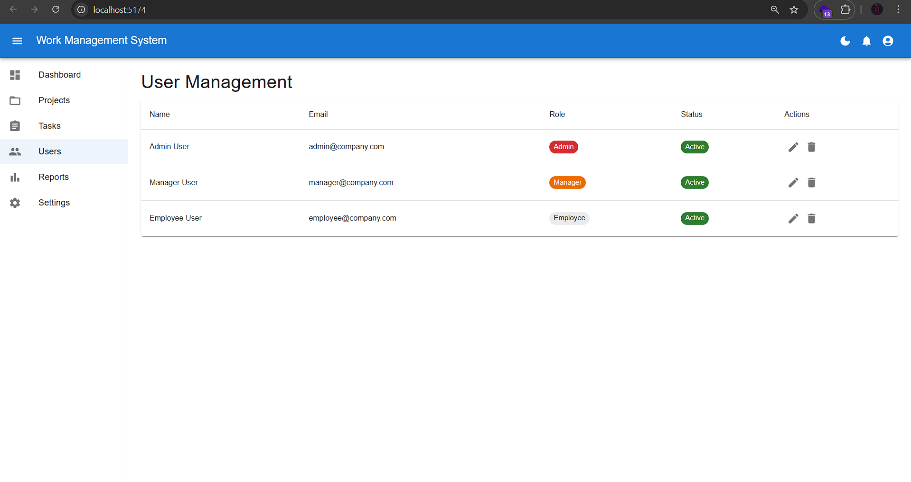
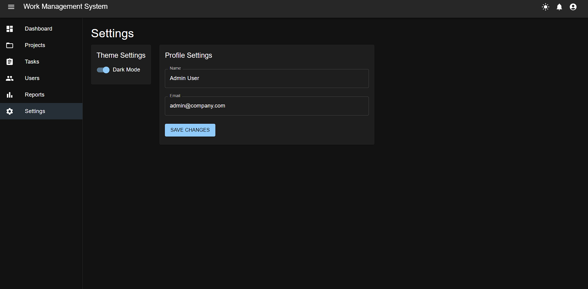
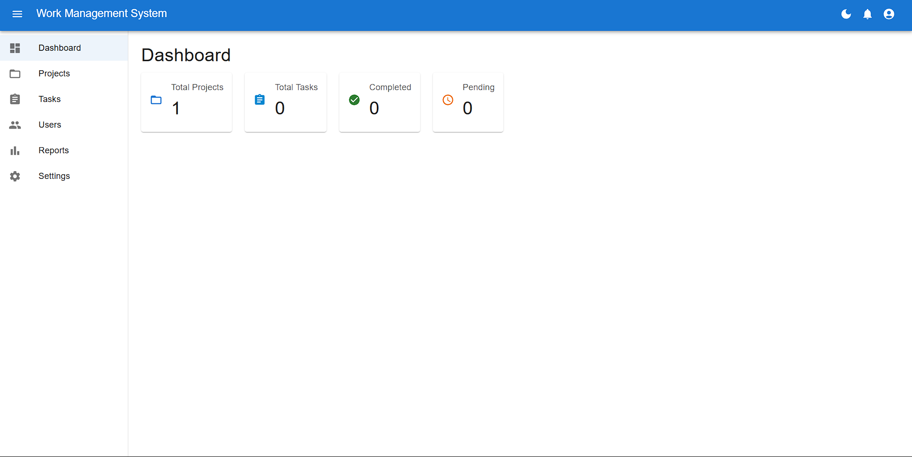

# Enterprise Work Management (Frontend-Only)

A **React + Material UI** frontend-only demo of an enterprise-grade **Work Management System**.

---

## ✨ Features

* **Authentication & Roles**

  * Demo login for `Admin`, `Manager`, and `Employee`
  * Role-based menu & page access
* **Dashboard**

  * Metrics: projects, tasks, completed, pending
* **Projects & Tasks**

  * CRUD projects & tasks
  * Task types, priorities
* **User Management** (Admin only)

  * Add/remove users, toggle status
* **Settings**

  * Dark/light theme (Material UI theme provider)
* **Persistence**

  * LocalStorage keeps data between refreshes
* **Tech**

  * React + Vite
  * Material UI + MUI Icons
  * React Context Api

---

## 🧑‍💻 Demo Users

| Role     | Email                                               | Password    |
| -------- | --------------------------------------------------- | ----------- |
| Admin    | [admin@company.com](mailto:admin@company.com)       | admin123    |
| Manager  | [manager@company.com](mailto:manager@company.com)   | manager123  |
| Employee | [employee@company.com](mailto:employee@company.com) | employee123 |

Or use the **“Try Demo”** dropdown to auto-login as any role.

---

## 📦 Installation

```bash
# Clone the repo
git clone https://github.com/yourname/ewm-frontend.git
cd ewm-frontend

# Install dependencies
npm install

# Start development server
npm run dev

# Build for production
npm run build
```

---

## 🛠️ Scripts

* `npm run dev` – start Vite dev server
* `npm run build` – build production app
* `npm run preview` – preview built app
* `npm test` – run tests (if using Vitest/Jest)

---

## 📂 Project Structure

```
src/
 ├─ components/
 ├─ context/
 ├─ App.jsx
 ├─ main.jsx
```

---

## 📸 Screenshots






